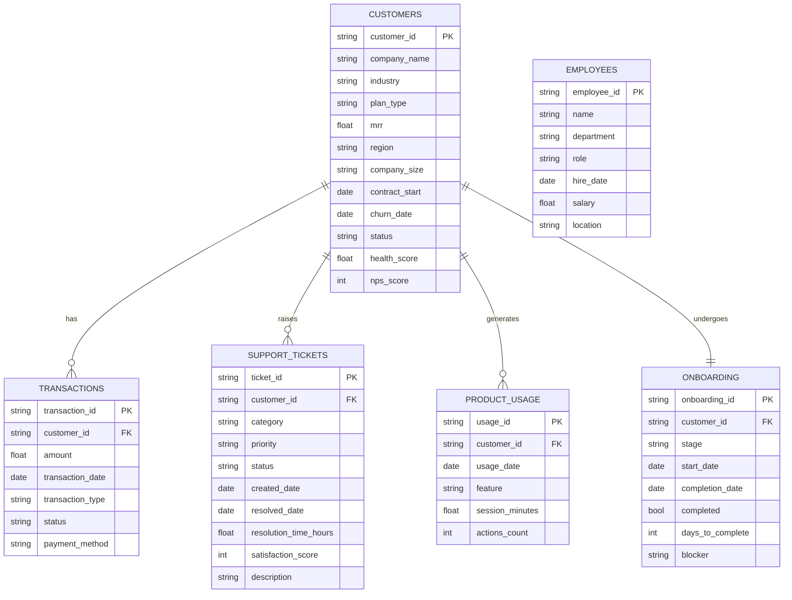

# BridgeIQ — Entity Relationship Diagram

## Mermaid ERD (paste at mermaid.live to render)

---

## Table Descriptions

| Table | Rows | Purpose |
|---|---|---|
| `customers` | 500 | Core customer entity — plan, MRR, health, status |
| `transactions` | ~3,978 | All billing events — subscriptions, upgrades, refunds |
| `support_tickets` | 4,000 | Customer support history with resolution times and CSAT |
| `product_usage` | 8,000 | Feature-level engagement tracking per session |
| `onboarding` | 500 | One-to-one with customers — tracks onboarding stage & blockers |
| `employees` | 120 | Internal workforce data for HR analytics |

---

## Key Relationships

- `customers` → `transactions`: One customer can have many transactions (subscription, renewal, upgrade, refund)
- `customers` → `support_tickets`: One customer can raise many support tickets over their lifecycle
- `customers` → `product_usage`: One customer generates many usage events across features
- `customers` → `onboarding`: Each customer has exactly one onboarding record (one-to-one)
- `employees` is standalone — no FK to customers (internal HR dataset)

---

## Render Instructions

1. Go to **https://mermaid.live**
2. Paste the Mermaid code block above
3. Export as SVG or PNG
4. Add to GitHub repo as `diagrams/erd.svg`
