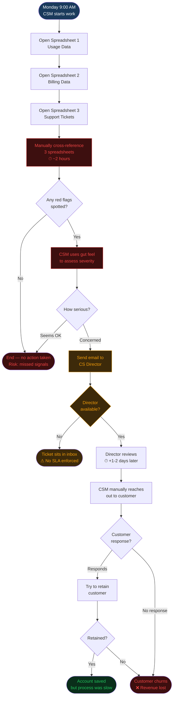

# AS-IS Process: Customer Churn Detection & Response

> Current state at Apex Solutions — manual, reactive, error-prone

## Pain Points Identified

| Step | Issue | Time Lost | Business Impact |
|---|---|---|---|
| Spreadsheet cross-reference | 3 separate data sources, no automation | 2-4 hrs/week | High — data gaps and errors |
| Risk assessment | Gut feel, no scoring criteria | Variable | High — inconsistent decisions |
| Escalation | Email chain, no SLA | 1-2 days | High — slow response |
| Customer outreach | Reactive — customer already decided | Too late | Critical — churn already decided |
| Audit trail | None | — | Medium — no learning loop |

**Root Cause:** No integrated data layer, no alerting system, fully manual and reactive process.
