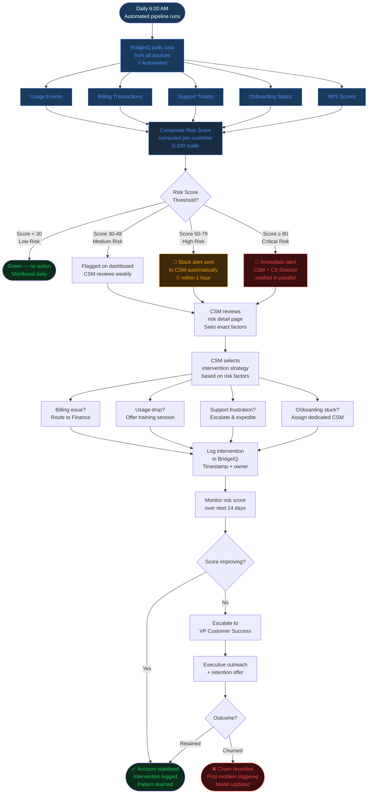

# TO-BE Process: Automated Customer Health & Churn Prevention

> Future state with BridgeIQ — automated, proactive, data-driven

## Improvements Over AS-IS

| Dimension | AS-IS | TO-BE | Improvement |
|---|---|---|---|
| Detection time | 7 days (weekly review) | < 6 hours (automated) | **97% faster** |
| Data sources | 3 manual spreadsheets | 5 integrated signals | **Unified & complete** |
| Risk assessment | Gut feel | Composite scoring algorithm | **Consistent & auditable** |
| Alert mechanism | Email chain | Slack + in-app notification | **Instant & trackable** |
| Intervention logging | None | Timestamped in BridgeIQ | **Full audit trail** |
| CSM time spent | 4 hrs/week manual review | < 30 min/week (review alerts only) | **88% time saved** |
| Outreach timing | Reactive (after decision) | Proactive (before decision) | **Prevention vs cure** |
